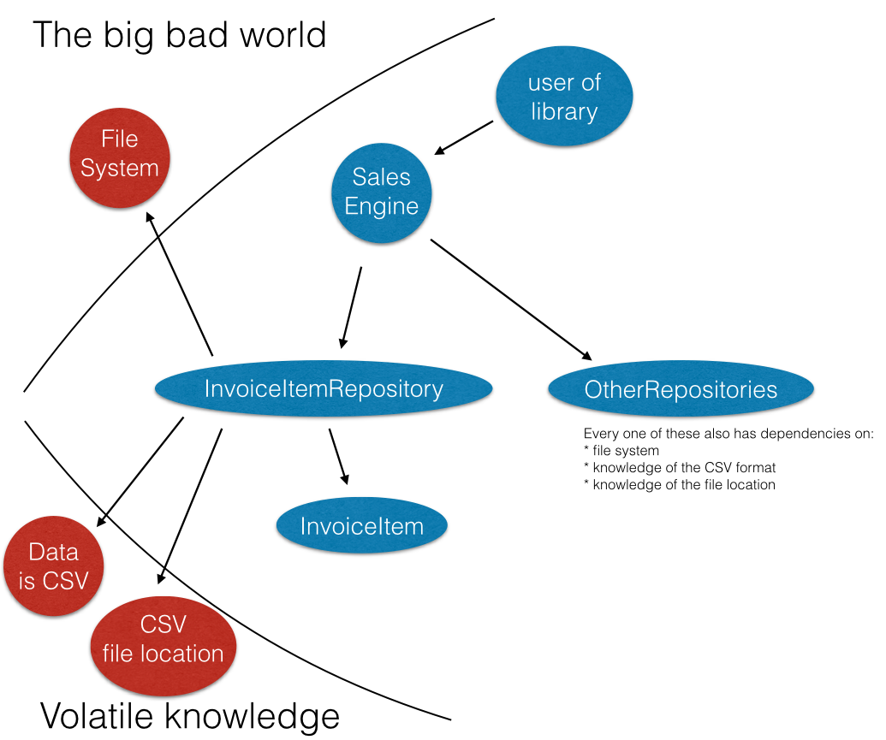
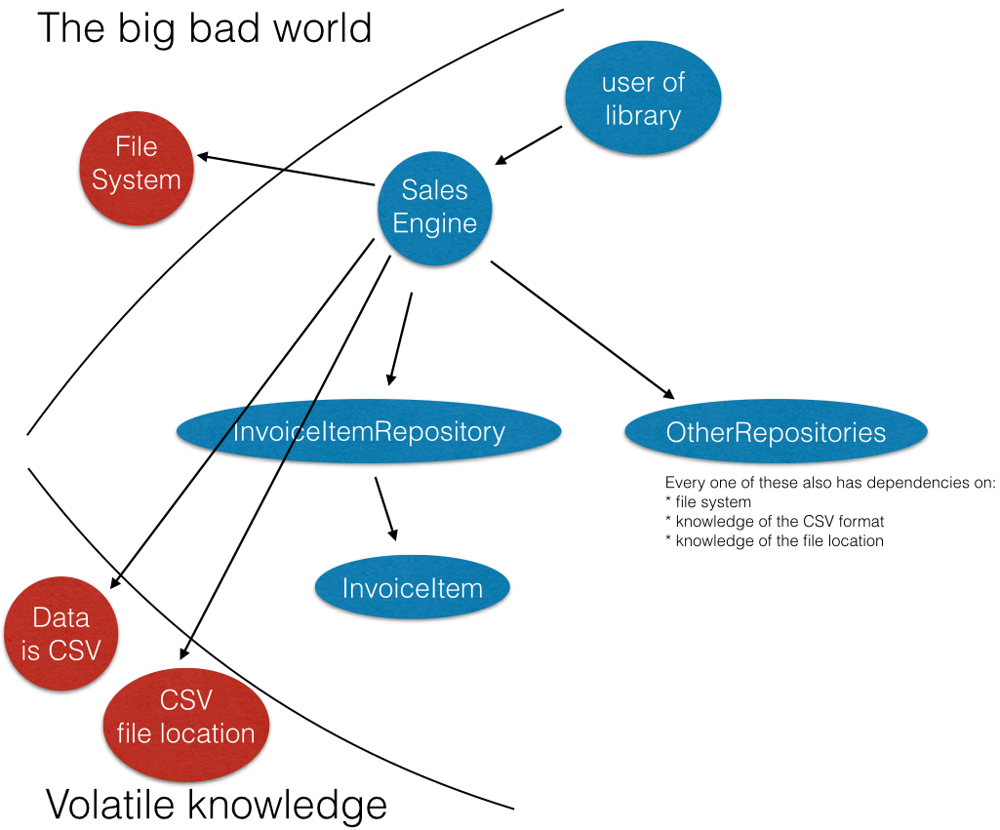

Improving Test Speed
--------------------

**First things first:** It's not really about test speed. It's about design.

Why test speed matters:
-----------------------

- *fast* feedback... think *instant* feedback.
- You can iterate much more quickly, which keeps you from losing context every time you jump to test. Keeping your head in the game.
- it implies good design

The case study:
---------------

- checkin with Ian and Rolando:
  ```
  $ git clone https://github.com/ianderse/sales_engine.git
  $ cd sales_engine
  ```
- PRE: tests take 77 seconds to run
  ```
  $ git checkout 0809f05
  $ rake
  Run options: --seed 36192

  # Running:

  ...........................E.........................S.......................................................

  Fabulous run in 76.721443s, 1.4207 runs/s, 1.3947 assertions/s.
  ```
- POST: tests take 0.01 seconds to run
  ```
  $ git checkout 449f3e5
  $ rake
  Run options: --seed 359

  # Running:

  .........................................................................................................

  Fabulous run in 0.013251s, 7923.9303 runs/s, 7999.3963 assertions/s.
  ```

What happened during that checkin?
----------------------------------

It proceeded as normal for quite a while.
Eventually, we got to the [InvoiceItemRepository](https://github.com/ianderse/sales_engine/blob/0809f05/lib/invoice_item_repository.rb)
and I told them the CSV handling was a problem.
They weren't particularly receptive to this, so I had to explain myself:

* The InvoiceItemRepository just gives me ways to deal with and interact with collections of InvoiceItems.
* It has nothing to do with the CSV
* Lets draw the dependencies



See the problem? These repositories can't focus on their knowledge of how to query the InvoiceItems
because they're coupled to the big bad world and volatile knowledge.

Too theoretical, Josh
---------------------

Still not receptive. I get it, your shit works,
this seems theoretical and irrelevant.
**But it is relevant.**
Lets talk about hypotheticals that happen fucking constantly:

I want to get my data from a database instead of a CSV,
or from a service, or JSON file, or to make them in memory during a test.

Look at [the initialize method](https://github.com/ianderse/sales_engine/blob/0809f05/lib/invoice_item_repository.rb#L12-13),
ts storing the filename:
```ruby
def initialize(engine)
  @engine        = engine
  csv            = CsvHandler.new("./data/invoice_items.csv")
  @invoice_items = csv.data.collect {|row| InvoiceItem.new(row, self)}
end
```

Not only does it know that its CSV,
but it knows *where* that CSV is!
Say I archive the data at the end of each year,
and now I want to query the archived data.
Guess where I'm going to keep my archived CSVs...
Not in `./data/invoice_items.csv`

Lets say I want to be able to query multiple values,
maybe items with a quantity of 5 that were created on January 1... how would you do that?
"I can just go to the repository and create a method for that"
you might be thinking.
But you can't know all the combinations of things I might want to query, there's quantity, unit_price, created_at, updated_at, item_id, and invoice_id
To give me every combination of two values I might want to query by, that's 15 methods... plus tests. To give me every combination I might want, that's 63 methods.

```ruby
attributes = %w[quantity unit_price created_at updated_at item_id invoice_id]  # => ["quantity", "unit_price", "created_at", "updated_at", "item_id", "invoice_id"]
attributes.combination(2).size                                                 # => 15
attributes.size                                                                # => 6
          .times.map { |n| attributes.combination(n.next).size }               # => [6, 15, 20, 15, 6, 1]
          .inject(0, :+)                                                       # => 63
```
What if I had 10 attributes? That's 1000 methods! (and 14 attributes is over 9000!)
```ruby
attributes = %w[1 2 3 4 5 6 7 8 9 10]  # => ["1", "2", "3", "4", "5", "6", "7", "8", "9", "10"]
attributes.size.times.map { |n|        # => #<Enumerator: 10:times>
  attributes.combination(n.next).size  # => 10, 45, 120, 210, 252, 210, 120, 45, 10, 1
}.inject(0, :+)                        # => 1023
```

"So how does this have anything to do with that" I hear you wondering.
Well, if I wanted to chain selectors together, how would I do it?
I'd need to initialize a new repository with the previously selected results,
then the scopes would be additive, like this

```ruby
InvoiceItemRepository.new(sales_engine)
  .find_all_by_quantity(5)
  .find_all_by_created_at('2000-01-01 00:00:01 UTC')
```

But how do I initialize a repository with the selected results?
It goes and fetches them from a CSV...

So to do this, I would have to have the selectors convert the results
to CSV, then write them to the file system, so they could initialize a new
repository with the selected results. But it's worse, that overrides
the existing CSV, so I have to move it out of the way before I do this,
then move it back when I'm finished. And of course, if anything else tries
to read that data while it's moved, it will get the filtered CSV rather
than the full CSV, so I need a mutex around the csv access to guarantee
that only one repository is using this at a time!

Sound absurd to you? **Yeah, that's what those circles and arrows mean.**

Alright, how do we fix it?
--------------------------

We don't want the repository to depend on these things, but **something**
has to. Where else can we put them?

**We can move them up to the SalesEngine.**
That makes sense, its responsibility is to just wire everything together,
it's at the top, where we have to deal with the world. It can protect the rest
of our library from this knowledge.

This is what we want:



How do we do that?
------------------

We use refactoring techniques:
* instead querying the CSV, we receive the queried data [as a parameter](https://github.com/ianderse/sales_engine/blob/449f3e5/lib/invoice_item_repository.rb#L10-13)
  ```ruby
  def initialize(engine, invoice_items_attributes)
    @engine = engine
    @invoice_items = invoice_items_attributes.collect {|params| InvoiceItem.new(params, self)}
  end
  ```
* Then the code which used to build it is moved up to the caller, [the SalesEngine](https://github.com/ianderse/sales_engine/blob/449f3e5/lib/sales_engine.rb#L29-30)
  ```ruby
  invoice_item_csv = CsvHandler.new("./#{dir}/invoice_items.csv")
  @invoice_item_repository = InvoiceItemRepository.new(self, invoice_item_csv.data)
  ```

What does this mean?
--------------------

It means our tests can now be decoupled from the giant csvs
that were making them expensive.
[This](https://github.com/ianderse/sales_engine/blob/449f3e5210952b2135ae90daab358109600a7605/test/invoice_item_repository_test.rb)
is how they did it, I'd probably want something more confidence inspiring (ie have items it should not find),
my suggestion was something more like [this](https://github.com/ianderse/sales_engine/blob/1762dbf224060706f2954ebeb672c96e34f2f38e/test/associations_test.rb#L25-34)

```ruby
def test_it_knows_what_items_are_associated_with_it
  set_world merchants_attributes: [{id: 12}],
            items_attributes:     [{name: 'A', merchant_id: 12},
                                   {name: 'B', merchant_id: 13},
                                   {name: 'C', merchant_id: 12},
                                  ]

  merchant = @merchant_repo.all.first
  assert_equal ['A', 'C'], merchant.items.map { |item| item.name }
end
```

Guess how fast that test runs? To prove it to them, I ran that test 10,000 times
and it was no more noticeable than if I had run it once. Hence, their 0.01 second
test speed.

Beyond that, you can *see* that this test works.
The old one depended on the specifics of 20k record CSV files.
They would assert counts, but you know they didn't actually count these.
Here, you can see what matters, you can see


What about chaining queries?
----------------------------

As a proof of concept, I made the chained queries code work.
There were a few changes I had to make, but the big ideas are this:

```ruby
class InvoiceItemRepository
  # ...
  include Enumerable
  def each(&block)
    invoice_items.each(&block)
  end

  def find_all_by_quantity(quantity)
    items = invoice_items.select {|invoice_item| invoice_item.quantity == quantity}
    InvoiceItemRepository.new(engine, items)
  end

  def find_all_by_created_at(created_at)
    items = invoice_items.select {|invoice_item| invoice_item.created_at == created_at}
    InvoiceItemRepository.new(engine, items)
  end
end
```

Which lets me do [this](https://github.com/ianderse/sales_engine/blob/61dd726f906b4fd67381472c086b0432a86c14d2/example.rb):

```ruby
jan = '2000-01-01 00:00:01 UTC'
feb = '2000-02-01 00:00:01 UTC'

invoice_items = [
  {id: 1, quantity: 5, created_at: jan},
  {id: 2, quantity: 1, created_at: jan},
  {id: 3, quantity: 5, created_at: jan},
  {id: 4, quantity: 5, created_at: feb},
  {id: 6, quantity: 1, created_at: feb},
]

InvoiceItemRepository.new("fake", invoice_items)
  .find_all_by_quantity(5)
  .find_all_by_created_at(jan)
  .each { |inv_item| puts inv_item.id }

# >> 1
# >> 3
```

But there's still a problem here!
---------------------------------

We haven't addressed that the CSVs are going to be stored in a different location!
Our user will still have to move CSVs around or change to specific directories
before running the application...

Your turn reader, look at the dependencies, how can we fix this?


What about InvoiceItemRepository depending on SalesEngine?
----------------------------------------------------------

Nice catch. I didn't draw this, because it's independent of this example.
In general, InvoiceItemRepository does still depend on all these things,
because it depends on SalesEngine. There are three caveats here, though:

1. This is a soft dependency, because it is passed in.
   So we can still skirt it by passing in a mock or something.
2. If we analyze how we use the sales engine, we see that we are using
   it to gain access to the other repositories. This is not dependent on SalesEngine
   so it could be separated. However, the cyclical dependency does have some implications
   about the process through which we would do this,
   but we do this intentionally for the next reason.
3. This setup exists because we are having the students build their own `ActiveRecord`
   and this is a flaw (among _many_) in ActiveRecord's design,
   which is thus necessarily mirrored.
